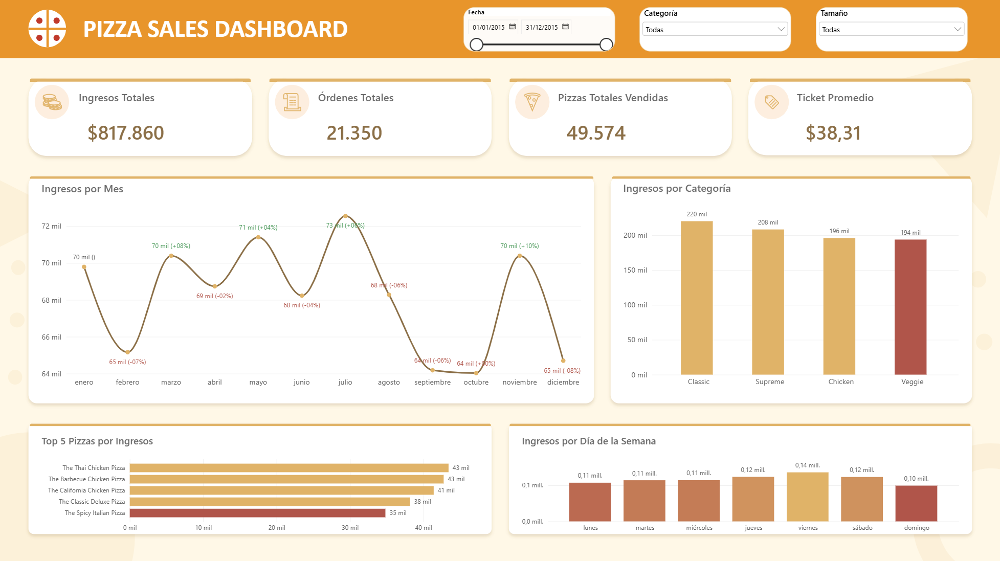

# Pizza Sales Dashboard

Dashboard de ventas de una pizzería armado con SQL Server + Power BI, sobre el dataset público de ventas de pizza (un año completo, 2015: ~21.350 órdenes, 96 variantes de pizza en 4 categorías).

Lo armé usando IA como copiloto en cada etapa —queries, DAX, hasta el diseño del fondo del reporte— auditando cada resultado contra los CSV originales antes de confiar en él.

## Qué muestra

- Ingresos, órdenes, pizzas vendidas y ticket promedio totales, filtrables por categoría, tamaño y rango de fecha
- Evolución mensual de ingresos, con variación % contra el mes anterior
- Ingresos por categoría (Classic, Supreme, Chicken, Veggie)
- Top 5 pizzas por ingresos
- Patrón de ventas por día de la semana

## Vista previa del dashboard



## Stack

- **SQL Server / T-SQL** — modelo de datos: 4 tablas normalizadas (pizza_types, pizzas, orders, order_details) con relaciones por FK
- **Power BI + DAX** — modelo semántico, medidas, tabla calendario
- **PowerPoint** — diseño del fondo del reporte, usado como imagen en Power BI

## Cómo correrlo

1. Cloná el repo y descargá los 4 CSV del dataset original (no incluidos en el repo, buscá "Pizza Place Sales dataset").
2. Abrí `01_pizza_sales_schema_and_load.sql` en SSMS.
3. Reemplazá `RUTA_A_TUS_CSV` por la carpeta donde descargaste los CSV — aparece en **4 lugares** dentro del script, uno por cada `BULK INSERT`.
4. Ejecutá el script completo.
5. Abrí `02_pizza_sales_analysis_queries.sql` para las queries de validación, y `Pizza_Sales_Dashboard.pbix` para el reporte.

## Estructura del repo

```
01_pizza_sales_schema_and_load.sql     - creación de tablas y carga de los CSV
02_pizza_sales_analysis_queries.sql    - queries de validación y exploración
Pizza_Sales_Dashboard.pbix             - archivo de Power BI
pizza_dashboard_background.png         - fondo del reporte
```

## Algunas cosas que encontré en el camino

- El ticket promedio real es $38,31 — más estable mes a mes de lo que esperaba.
- Domingo es el día con menos ventas ($99 mil) contra viernes, el pico ($136 mil) — casi 40% de diferencia.
- "Classic" lidera en ingresos totales, pero por muy poco margen sobre "Supreme".

## Notas

Datos públicos con fines de práctica, no de un negocio real. Cada total del dashboard está validado a mano contra los CSV originales antes de confiar en cualquier medida DAX — varias veces el número no cerraba a la primera, y quedó documentado en el proceso de armado qué tipo de error era cada vez (relaciones mal armadas, contexto de filtro, precisión de decimales).
